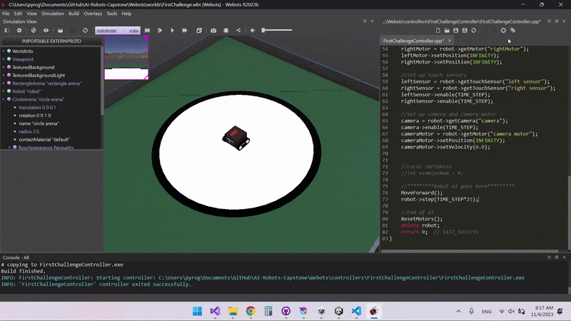
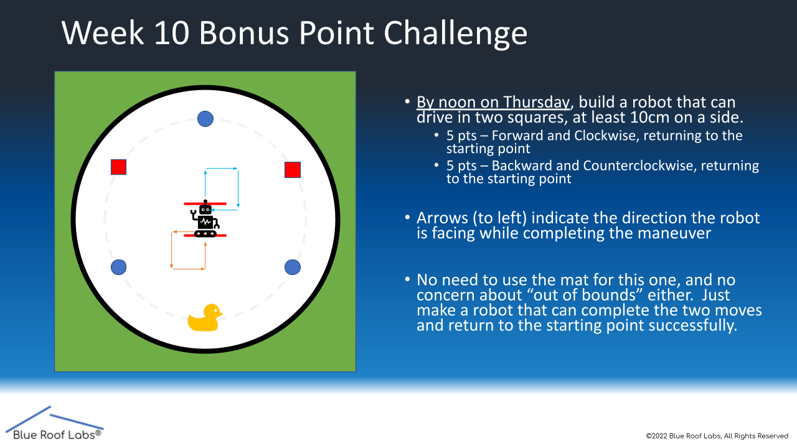
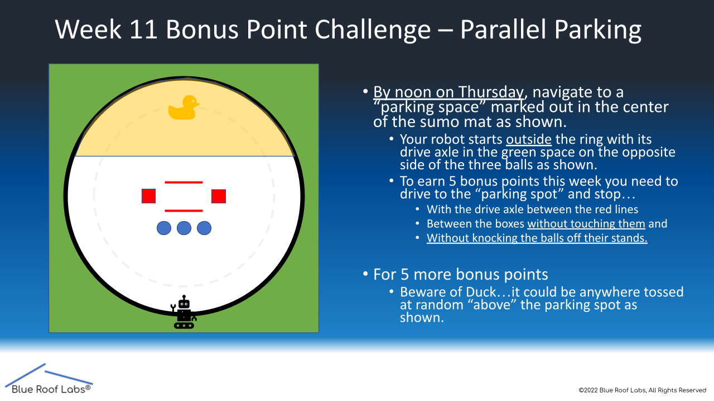

<!-- Webots Challenges -->

## Purpose
<!-- About The Project -->  
This is a Bradley University CS capstone project, currently designing and developing robot prototypes and testing thereof for usage in a related Bradley AI course. Feedback to this repository in labeling points of improvement will help to benefit current and future students usage of this project's and it's outcomes.

!!!This Project Documentation is currently in development and subject to change!!!

*future screenshots*

<details>
 <summary>Webots Setup</summary>
  <ol>
<!-- -->
<summary>Webots Setup</summary>
<!--Webots Setup -->

Webot's site can be found at [https://cyberbotics.com/](https://cyberbotics.com/) where you will find the installer download on the homepage.

Confirm the correct operating system installer as shown below the download button, using the arrow dropdown menu next to the download button if it does not match your system.

* Run the installer you just downloaded
* On Windows, in the case of an 'Windows protected your PC' warning prompt, click on 'More info' and then confirm to run
* Follow the install wizard dialogues and installations to finish setting up Webots!

<!--Understanding Webots -->

Let's start by opening up the Webots tutorial world: 
* In the file explorer open up the 'world' file from this repository located at "...AI-Robots-Challenges\Webots\worlds\moose_demo.wbt"
* When you open up Webots for the first time, you'll be prompted to choose a theme, continue by selecting 'Start Webots with the selected theme'
* Congrats, you've successfully loaded the world! Here you can get accustomed to the environment and interface
* To rotate the camera, hold left-click while moving your mouse inside the simulation window
* To move the camera, hold right-click while moving your mouse inside the simulation window
  
This 'world' you opened up is one of Webot's open source demo worlds. Here, the robot demonstates simple movement ai that traverses between defined checkpoints. 

Take note of some important features of the interface:
* The left side of the interface contains the hierarchy of nodes (similar to objects)
* The right side contains the built in text editor section where you can edit scripts inside the program
* Above the simulation window, you'll find the main functions for the simulation, tooltip information is displayed when hovered over the different functions
* The 'pause/play' function starts or pauses the current world simulation
* To the left of that, the '|<<' function resets the time of the simulation to 0
* Pausing the simulation before resetting will keep the simulation in a paused state after resetting
 
<!--GitHub Setup-->

 If you are a student or someone that would like to go through the challenges yourself, creating your own clone of the repository can be accomplished as follows:
 * Download and install 'Github Desktop' from [https://desktop.github.com/](https://desktop.github.com/)
 * Go to 'File' -> 'Clone a repository', and the after selecting the URL tab input the URL of this repository, otherwise on the Github webpage of the repository, click the '<> Code' dropdown and select 'Open with Github Desktop'
 * Once cloned, you now have your own version of the project and upload your personal projects to your own Github
 
Now that you have the project files, you may explore the various challenges and worlds provided. The first challenge is located at "...AI-Robots-Challenges\Webots\worlds\FirstChallenge.wbt".

---
 
Provided below are the student challenges, designed to help student's understanding of various AI principle and test code for their robots functionality before transferring to the physical hardware.

 </ol>
</details>


<details>
  <summary>Challenge 1</summary>
  <ol>
 
 
 
 
 ## Make a Box (Optional)
 
 If you want to understand how Webots works, you will need to understand the node system. Nodes are shown in the left window, and nodes work both as objects and as variables. To understand it better, let's make a box.
 
 
 
 * Click the Add Node button (+). Inside the Base Nodes dropdown, select solid and click Add
 * When selecting the Solid "solid" object you just added, click and drag the object so that it isn't inside the robot
 * Inside the Solid "solid" object dropdown, double-click on the children node or right-click->Add New to add a node to the solid
 * Inside the Base Nodes dropdown, select the shape node, and click Add
 
 Objects, such as robots and boxes, in Webots are nodes. The children of those nodes are the properties of the parent nodes. Now that we have a solid object, let's specify what kind of shape it is by changing the properties.
 
 * Inside the Shape dropdown, add a node to the Geometry node by double-clicking and select Box under Base Nodes
 * Inside the geometry box, select size, and set the size values to .25m in X, Y, and Z
 * Add a node to the appearance by double-clicking and select appearance under Base Nodes
 * Inside the appearance dropdown, double-click the material and add the material
 * Change the diffuse color to whatever color you like
 
 By making this cube, you should understand the basics of Webots' node system. There is more to making this object physically simulated (adding physics and specifying the bounding object as a box), but this is all you need to know. Now let's reset the simulation so there isn't a random box by pressing the |<< button.

 
 ## Coding the Robot
 
 Let's start coding using the built-in IDE on the right window.
 
 The way Webots programming works is you get a reference to each motor of the robot through code and then you tell that motor what to do. Those motors will continuously do that until given a new command. Webots lets you wait time as a function in the code, so you don't need to constantly tell the motor what you want it to do.
 
 If you look at the code, you can see that I made the functions MoveForward(), MoveBack(), TurnLeft(), and TurnRight() which tell the motors to rotate respectivly. Let's use these functions to write a robot that moves forward. The robot AI starts on line 75.
 
 * On line 77, the robot only waits one step, which isn't enough to move forward. Let's change that to 25 steps by changing the line to
 ```sh
 robot->step(TIME_STEP*25);
 ```
 * To compile the code, first remove the previous build, and press the top right button that looks like a comb (see GIF)
 * After it's completed, hit the gear icon next to it to build your code
 * Once completed, you will be asked if you want to reload or reset, hit reload
   * If you changed something in the world, you will be asked if you want to save, hit discard. If you don't see the popup
   * When the simulation reloads, make sure you are in play mode by pressing the > button on the top. If you are not, then you won't see your robot move
 
 
 
 Now that know the basics for coding, try the week 10 bonus point challenge where you move the robot in a forward square then make it go backward landing on the starting placement.
 
 
 
 It you cannot complete the bonus point challenge because it's too confusing or hard, fill out the form and explain why.

 
 ## Task
 
 Once you've completed (or were unable to complete) the first challenge, please fill out this Google form [https://forms.gle/rBniEH7UuqJXANCg7](https://forms.gle/rBniEH7UuqJXANCg7). It will take 5-10 minutes to fill out. 
 
 ---
 
</ol>
</details>


<!--## Project Setup

If you had forked this repository, sync the respotory

* In the top right corner of the GitHub page that was forked, under the green code button hit the sync fork button
* Click Update branch (you may need to refresh the page to see changes)
* Fetch changes from GitHub desktop

Let's open up the Webots world

* In the file explorer open up the file from this GitHub at ...AI-Robots-Challenges\Webots\worlds\SecondChallenge.wbt
-->

<!--## Coding with the camera

Since last challenge, there are more functions, that aren't necessary for this challenge, but could be helpful. DriveForward(angle) and TurnCameraUp()/TurnCameraDown(). The TurnCamera functions are work in progress because the camera can turn inside the robot.

The AI starts on line 101, and I've premade a while loop that prints the RGB of a pixel on the camera. Specifically the bottom middle pixel. This is done by imageGetColor(Image, width, x, y) function. You can see the camera in the top left corner of the simulation window. If you move the middle ball and use the red arrow to drag it toward the robot, the print statement will change.
-->

<!--

* Now try the parallel parking challenge
* Once you complete it, feel free to move Evil Duck onto the top of the track for extra credit.

-->
## Repository Feedback

If you haven't already completed the google form, please feel free to add your input to our project here as it is much appreciated: [https://forms.gle/rBniEH7UuqJXANCg7](https://forms.gle/rBniEH7UuqJXANCg7) 
